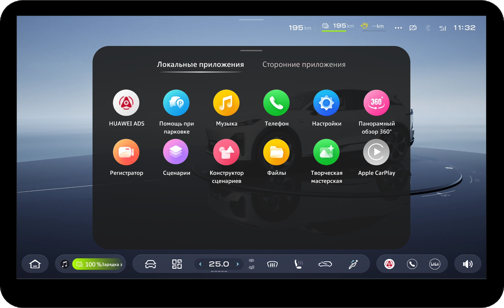
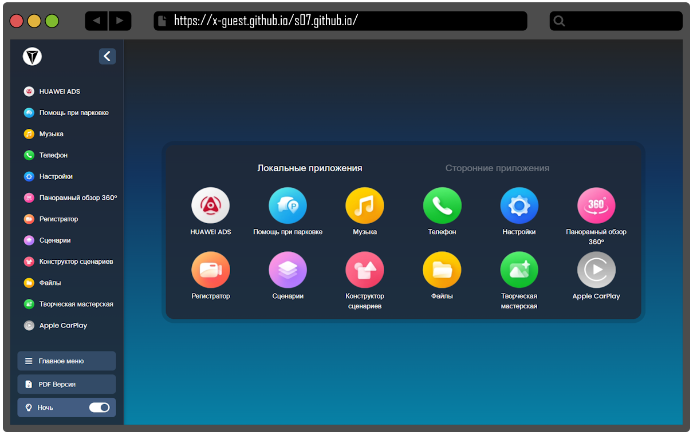
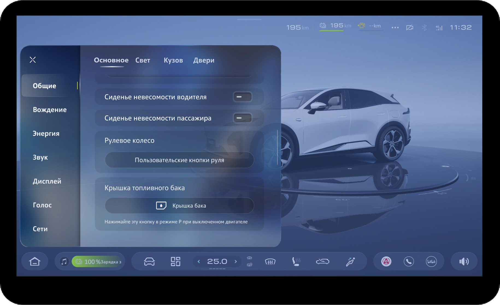
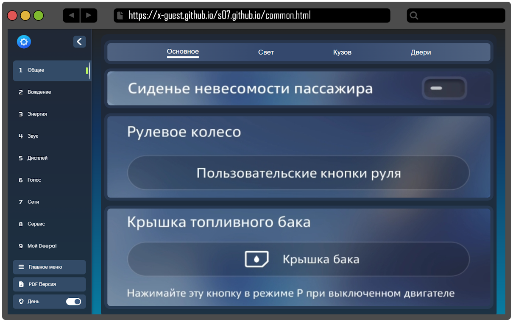
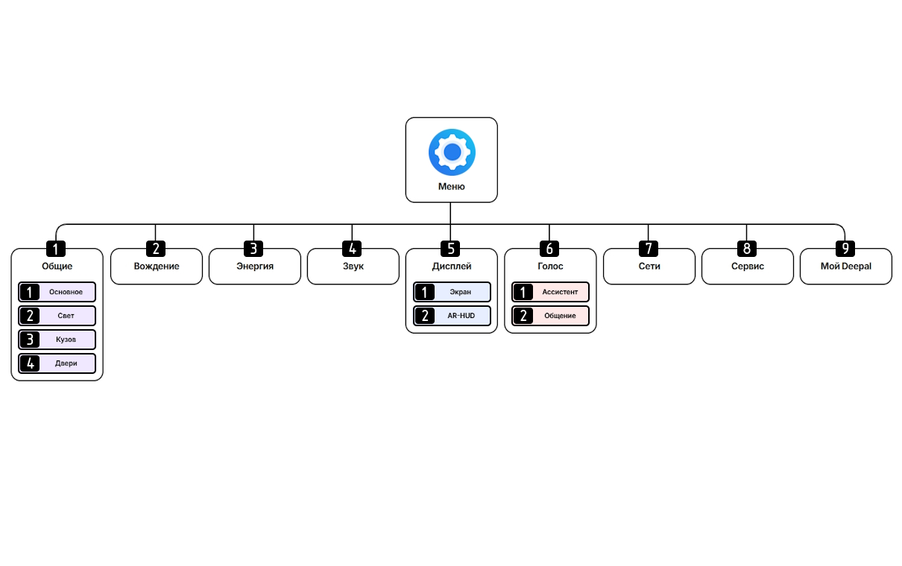
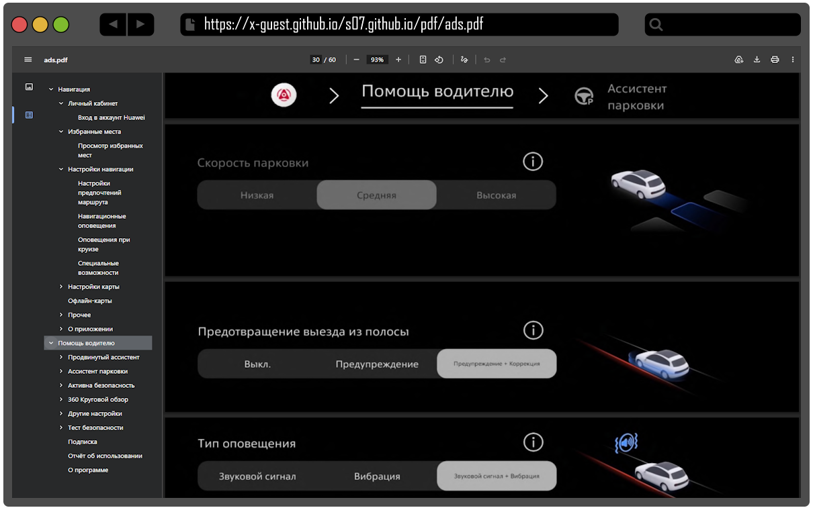
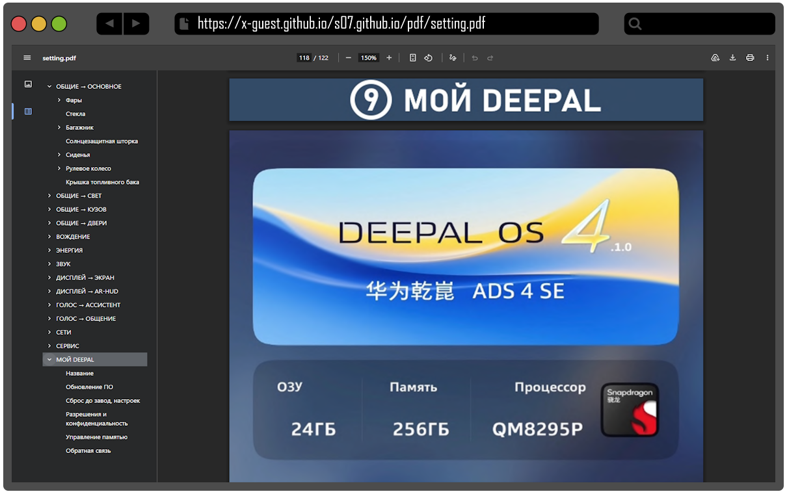

# Перевод (русификация) Deepal S07 2026
Данный проект является web-страницей перевода настроек и приложений авто Deepal S07 рестайлинг 2026 (DEEPAL OS 4.1.0), направлен чтоб избавить владельцев китайского автомобиля Deepal S07 2026 от рутины перевода скриншотов.

## [Главное меню](https://x-guest.github.io/s07.github.io/)

Выше на фото №1 (рис. с лева) изображено русифицированное главное меню автомобиля Deepal S07 рестайлинг 2026, на фото №2 (рис. с права) [web версия перевода меню](https://x-guest.github.io/s07.github.io/).

## [Меню настроек](https://x-guest.github.io/s07.github.io/common.html)

Выше с левана фото изображено русифицированное меню настроек авто., с права [web страница перевода меню настроек](https://x-guest.github.io/s07.github.io/common.html).

## Схема раздела меню настроек.
Схематично, раздел перевода меню настроек выглядит аналогично разделам меню настроек на головном устройстве (центральном планшете) автомобиля. 

## [PDF версия](https://x-guest.github.io/s07.github.io/download.html)

Также доступны для скачивания PDF файлы перевода (для просмотра офлайн) [Настройки ADS](https://x-guest.github.io/s07.github.io/pdf/ads.pdf) и [Настройки авто]( https://x-guest.github.io/s07.github.io/pdf/setting.pdf), в файлах PDF организованы закладки (каталог) для удобного поиска интересующего раздела настроек, также возможен поиск по тексту (весь текст распознан).
